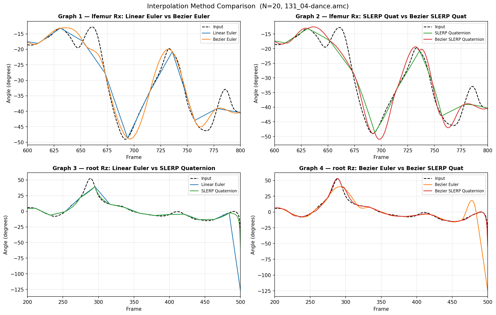

# CSCI 520 Assignment 2 — Motion Capture Interpolation

## 1. Introduction

Motion capture (mocap) records the movement of a real performer by tracking physical markers placed on their body. The result is a dense sequence of poses sampled at a fixed framerate, where each pose stores the position and orientation of every bone in the skeleton. In practice, storing or transmitting every frame is expensive, and in some scenarios the capture hardware itself may only record at a low framerate. A common solution is to store only a sparse set of keyframes and reconstruct the intermediate poses mathematically through interpolation. The quality of this reconstruction directly affects how natural the resulting animation looks. Poor interpolation produces visible artifacts — joints that snap, spin unnaturally, or follow implausible paths between poses. This report evaluates four interpolation methods applied to motion capture data: Linear Euler, Bezier Euler, Linear Quaternion (SLERP), and Bezier Quaternion. Each method makes different mathematical choices about how to represent rotations and how to construct a smooth path between keyframes, leading to measurable differences in output quality.

---

## 2. Methods

**Linear Euler.** The simplest interpolation method treats each bone's rotation as three independent Euler angles (θx, θy, θz) and performs linear interpolation (lerp) directly on those scalar values. Given two keyframes at times t=0 and t=1, an intermediate frame at time t is computed as θ(t) = (1−t)·θ₀ + t·θ₁ for each angle independently. While straightforward to implement, this approach has two significant drawbacks. First, because it interpolates each axis independently, it does not follow the shortest rotational path between two orientations — the resulting motion can take an unnecessarily long arc or produce unnatural spinning. Second, linear interpolation produces C0-continuous motion: the velocity is constant within each segment but changes abruptly at every keyframe, creating visible "kinks" in the animation.

**Bezier Euler.** This method retains the Euler angle representation but replaces linear interpolation with a cubic Bezier spline, achieving C1 continuity across keyframe boundaries. For each segment between two keyframes q_n and q_{n+1}, two interior control points are computed from the neighboring keyframes using the formula p₁ = q_n + (q_{n+1} − q_{n−1})/3 and p₂ = q_{n+1} − (q_{n+2} − q_n)/3. The curve is evaluated using the De Casteljau algorithm, which recursively linearly interpolates between the four control points. Because the tangent at each keyframe is determined by its neighbors, the velocity is continuous across boundaries and the motion no longer exhibits kinks. However, it still inherits the fundamental limitation of Euler angles: interpolation is performed on raw angle values, not on the underlying rotation space, so artifacts from gimbal lock and non-shortest-path rotation remain possible.

**Linear Quaternion (SLERP).** Rather than interpolating Euler angles directly, this method first converts each bone's rotation into a unit quaternion, which represents orientations as points on a 4D unit sphere. Interpolation is then performed using Spherical Linear Interpolation (SLERP), which moves at constant angular velocity along the great circle arc connecting two quaternions on the sphere. Given quaternions q₀ and q₁ with angle θ between them, SLERP is defined as q(t) = sin((1−t)θ)/sin(θ) · q₀ + sin(tθ)/sin(θ) · q₁. A sign check ensures the shorter arc is always taken. This eliminates the gimbal lock and unnatural rotation paths inherent to Euler interpolation, producing more geometrically correct motion. However, like Linear Euler, it is only C0 continuous — velocity changes abruptly at keyframe boundaries.

**Bezier Quaternion.** This method combines the rotational correctness of quaternions with the smoothness of Bezier splines by constructing a cubic Bezier curve directly on the unit quaternion sphere. Control quaternions are computed using the `Double` operation, which reflects a quaternion p across q on the sphere: Double(p, q) = 2(p·q)q − p. For each segment, the right control point of q_n is a_n = SLERP(q_n, Double(q_{n−1}, q_n), 1/3), and the left control point of q_{n+1} is b_{n+1} = SLERP(q_{n+1}, Double(q_{n+2}, q_{n+1}), 1/3). The curve is evaluated using the De Casteljau construction with SLERP in place of lerp, recursively blending the four control quaternions. The result is C1 continuous in rotation space and follows geometrically natural paths, making it the highest-quality method among the four. The tradeoff is increased computational cost due to the multiple SLERP evaluations per frame per bone.

---

## 3. Results

All four methods were evaluated on the `131_04-dance.amc` motion with `131-dance.asf` at N=20, meaning every 20th frame was kept as a keyframe and the 19 frames between each pair were reconstructed. Graphs 1 and 2 show the lfemur joint rotation around the X axis over frames 600–800. Graphs 3 and 4 show the root joint rotation around the Z axis over frames 200–500.

**Graphs 1 and 2** (lfemur Rx) reveal that all four methods broadly follow the shape of the input signal. Both Bezier methods track the amplitude of the input peaks more closely than their linear counterparts — most visibly around the large swing near frame 695, where linear methods flatten the curve while Bezier methods approach the true peak value. The difference between Euler and quaternion representations is less pronounced for this particular joint and axis since the lfemur X rotation does not involve large enough angular displacements to trigger gimbal lock.

**Graphs 3 and 4** (root Rz) reveal the most dramatic difference between the two angle representations. Both Euler methods — Linear Euler and Bezier Euler — produce a catastrophic spike to approximately −125° beginning around frame 483, while the input signal and both quaternion methods remain near 0°. This spike occurs because the keyframe at frame 483 and the next keyframe (at frame 504) are separated by a large root rotation in angle space. Euler linear interpolation draws a straight line between the two raw angle values, producing an extreme and physically implausible trajectory. SLERP quaternion and Bezier SLERP quaternion both avoid this entirely by operating in rotation space and always taking the shortest arc between two orientations.

---

## 4. Discussion

The results demonstrate two distinct axes of quality difference across the four methods: **continuity** (Linear vs. Bezier) and **rotation representation** (Euler vs. Quaternion).

**Linear vs. Bezier.** The Bezier methods consistently track the shape of the input signal more accurately than their linear counterparts, particularly around motion peaks where the velocity is changing rapidly. Linear interpolation produces C0-continuous motion — velocity changes abruptly at every keyframe, creating visible kinks in the plotted curves. Bezier interpolation is C1-continuous, meaning the derivative is matched at keyframe boundaries, resulting in a smoother curve that better approximates the original motion. This difference becomes increasingly important as N grows larger, since wider keyframe gaps give the linear method more opportunity to diverge from the true trajectory.

**Euler vs. Quaternion.** The spike observed in Graphs 3 and 4 for both Euler methods is the key finding of this comparison. Euler angles represent rotations as three independent scalar values, and interpolating them directly does not respect the geometry of rotation space. When two keyframes are separated by a large rotation — particularly one that crosses a representational boundary — the interpolated path can take a wildly incorrect route through angle space. Quaternion SLERP avoids this by representing rotations as points on a unit 4D sphere and interpolating along the great circle arc, always guaranteeing the shortest and most geometrically natural path. This makes quaternion-based methods significantly more robust for motions involving large or rapid rotations, such as spins and turns in the dance sequence.

**Method ranking.** From worst to best: Linear Euler produces kinks and is vulnerable to large-rotation artifacts. Bezier Euler is smoother but retains the same rotational instability. SLERP Quaternion eliminates the rotation artifact but still exhibits velocity discontinuities at keyframes. Bezier SLERP Quaternion is the strongest method — it is both C1-continuous and geometrically correct in rotation space.

---

## 5. Conclusion

This report compared four motion capture interpolation methods across two joints and two motion characteristics. The results show that the choice of angle representation has a larger impact on correctness than the choice of interpolation order — both Euler methods produced a severe artifact on the root Z rotation that neither quaternion method exhibited. Between the two quaternion methods, Bezier SLERP quaternion is the clear winner, providing smooth, physically plausible reconstructions even at large N values. For practical applications where motion quality matters, Bezier SLERP quaternion is the recommended method, with the understanding that it carries higher computational cost due to multiple SLERP evaluations per bone per frame.
